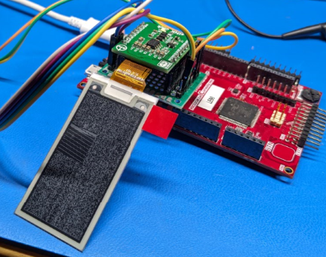

# eink MIKROE driver package

This package allows the Legato graphics system to 
use the MIKROE eink displays.

# Example hardware

| Hardware | Part number |
| --- | --- |
| PIC32CM LE00 Curiosity pro | [PIC32CM5164LE00100](https://www.microchip.com/en-us/product/PIC32CM5164LE00100) |
| EInk click board and 2.13" display | Mikroe [E-Paper Bundle 2](https://www.mikroe.com/e-paper-bundle-2) |

The click board (charge pump) and display (122x250) are available separately.
This is clearly not the same controller used for the AMP displays.

# Mikroe software

The basic driver code comes from the Mikroe github repo [mikrosdk_click_v2](https://github.com/MikroElektronika/mikrosdk_click_v2). 
The body of the code was taken up directly to provide the display-command sequences,
but the SPI interface was replaced by functionally equivalent
macros to invoke the Legato/Harmony drivers.
The command/data sequences produce a suboptimal SPI data stream, but ease of porting was more important.

The LUT information is factored into a separate file
for similarity to the AMP display files.
